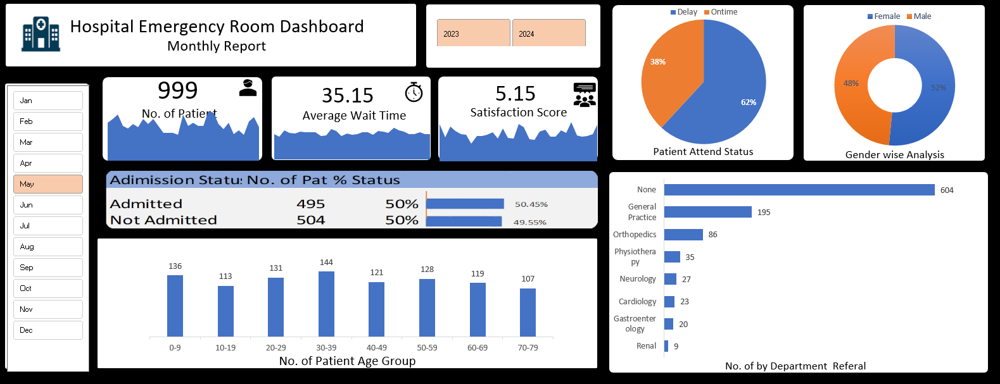

# Hospital Emergency Room Analysis Dashboard

## Project Purpose
The objective of this project is to develop a **Hospital Emergency Room Analysis Dashboard** using Power BI that enables hospitals to monitor and optimize emergency department operations.  
This dashboard is designed to provide actionable insights by transforming raw patient data into meaningful metrics. It focuses on improving operational efficiency, identifying performance gaps, and supporting hospital administrators, doctors, and management in making data-driven decisions. Ultimately, the analysis helps enhance patient care, reduce wait times, and allocate resources effectively across departments.  

---

## Dashboard Snapshot
Here’s a preview of the **Emergency Room Analysis Dashboard**:  

  

---

## Project Steps
The project follows a structured approach:  
1. **Define Objectives and Scope:** Clearly outline the goals and expected outcomes of the dashboard.  
2. **Collect and Refine Requirements:** Identify the essential KPIs and performance measures relevant to emergency room operations.  
3. **Create Supporting Data Structures:** Build necessary tables, including a Calendar table and custom measures.  
4. **Develop DAX Calculations:** Implement DAX formulas to generate age groups, timeliness metrics, and patient status.  
5. **Design and Deploy Dashboard:** Build interactive visualizations, apply filters, and finalize the dashboard for stakeholder use.  

---

## Key Requirements (KPIs)
The dashboard focuses on monitoring the following performance indicators:  
- **Patient Admission Status:** Evaluate how many patients were admitted compared to those not admitted.  
- **Patient Age Distribution:** Categorize patients into defined age groups to identify demographic patterns.  
- **Timeliness of Service:** Measure the percentage of patients who received medical attention within 30 minutes, a critical performance benchmark.  
- **Gender-Based Analysis:** Track patient counts by gender to recognize trends in emergency room visits.  
- **Department Referrals:** Identify which departments receive the most referrals, helping to uncover demand hotspots across specialties.  

---


## Supporting Tables

### Calendar Table
A Calendar table was created to support time-based analysis across multiple years.  

```powerquery
= List.Dates(#date(2023,01,01),731,#duration(1,0,0,0))
